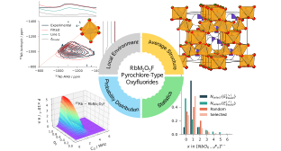

# Supporting Data for “Revealed Preferential Short-Range Anion Ordering in Disordered RbM2O5F (M = Nb, Ta) Pyrochlore-Type Oxyfluorides”

## Graphical Abstract

**Author:** Ouail Zakary  
**ORCID:** [0000-0002-7793-3306](https://orcid.org/0000-0002-7793-3306)  
**E-mail:** [Ouail.Zakary@oulu.fi](mailto:Ouail.Zakary@oulu.fi)  
**Website:** [Ouail Zakary - webpage](https://cc.oulu.fi/~nmrwww/members/Ouail_Zakary.html).
**Personal Website:** [Ouail Zakary - personal webpage](https://ozakary.github.io/)

This is the Supporting Dataset for the manuscript “Revealed Preferential Short-Range Anion Ordering in Chemically Disordered RbM2O5F (M = Nb, Ta) Pyrochlore-Type Oxyfluorides”.

The dataset comprises the following sections:

1. Powder X-ray diffraction data. ([directory](./powder_X-ray_diffraction/))
2. High-field solid-state nuclear magnetic resonance spectroscopy data. ([directory](./ssNMR_spectra_exp_&_fit/))
3. Steps for building and generating structural configurations from the unit cell of RbNb2O5F. ([directory](./configurations_generation_steps/))
4. First principle calculations data. ([directory](./first_principle_calculations/))
6. Python scripts used to simulate the theoretical NMR spectra. ([directory](./simulated_nmr_spectra/))
5. Python scripts and raw numerical data for all figures included in the main manuscript and the Supporting Information. ([directory](./figures/))

## Citations

If you use this data, please cite the following: \
\
**Preprint(!!!NOT PEER REVIEWED YET!!!):** Zakary, O.; Body, M.; Sarou-Kanian, V.; Charpentier, T.; Legein, C. Revealed Preferential Short-Range Anion Ordering in Chemically Disordered RbM2O5F (M = Nb, Ta) Pyrochlore-Type Oxyfluorides. **2025**.

\
**Dataset(!!!NOT PEER REVIEWED YET!!!):** Zakary, O.; Body, M.; Sarou-Kanian, V.; Charpentier, T.; Legein, C. (**2025**). Supporting Data for “Revealed Preferential  Short-Range Anion Ordering in Chemically Disordered RbM2O5F (M = Nb, Ta) Pyrochlore-Type Oxyfluorides”. *figshare. Dataset.*

---

For further details, please refer to the respective folders or contact the author via the provided email.
